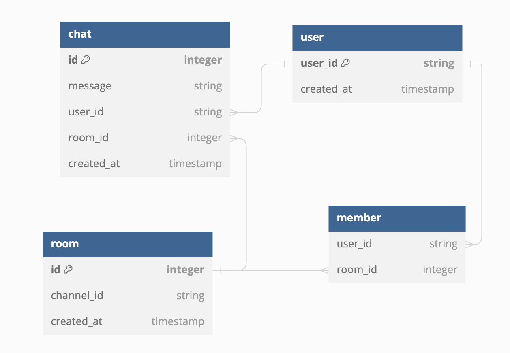
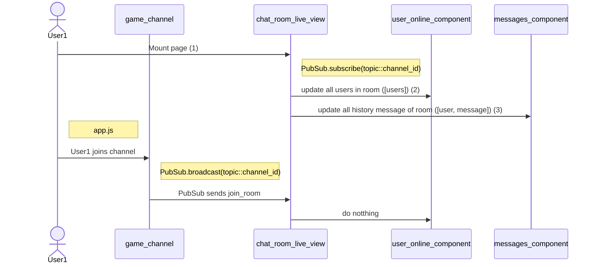
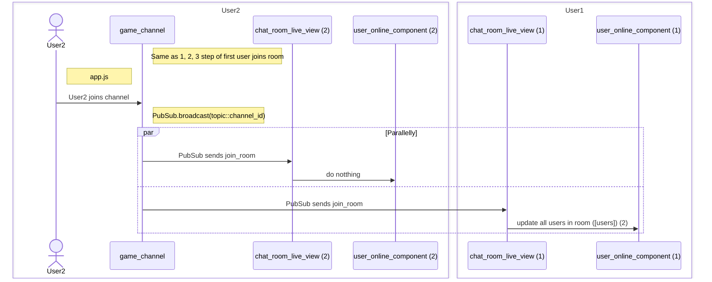
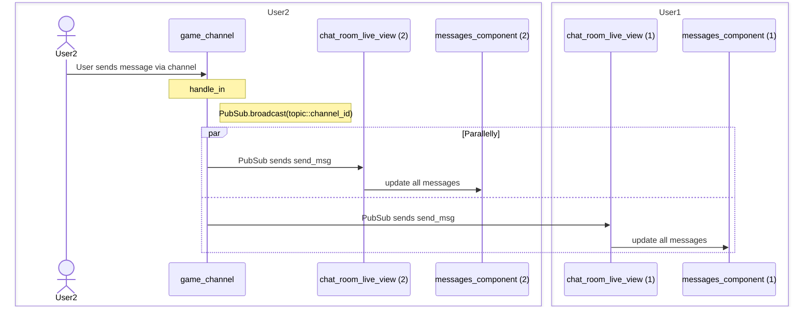
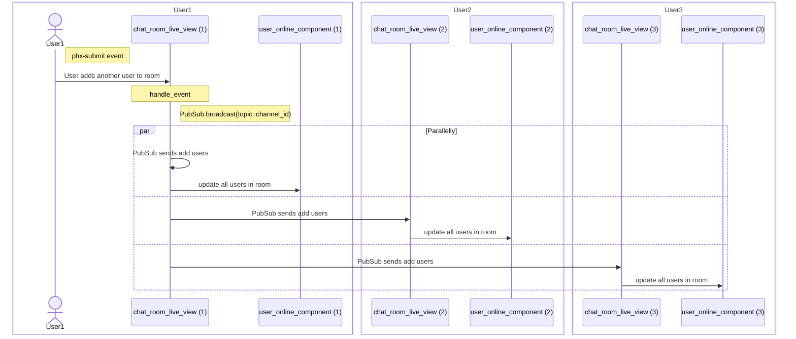
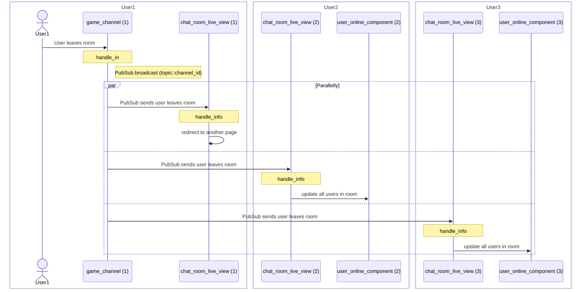

# ChatService (LiveView)

To start your Phoenix server:

  * Run `mix deps.get` to install dependencies
  * Run `mix ecto.create` to create the storage for the given repository.
  * Run `mix ecto.gen.migration *name of file*` to generates a new migration for the repo.
  * Run `mix ecto.migrate` to runs the repository migratio
  * Start Phoenix endpoint with `mix phx.server` or inside IEx with `iex -S mix phx.server`

Now you can visit [chat_service page](http://localhost:8080/chat_room?user_id=john&channel_id=game_1) from your browser.

+ `http://localhost:8080/chat_room?user_id=john&channel_id=game_1`

+ `game_1` is room and `john` is user

## Database:

## Model
lib/chat_service/room
=> model chat room

priv/repo/migrations/*_create_room_table.exs
=> Migrations are used to modify your database schema over time.

## View

## Controller

+ lib/chat_service_web/controllers/room_channels/chat_room_live_view.ex
 => Handle main live view, handle user joins room and send message, add user by clicking button

 + lib/chat_service_web/controllers/room_channels/messages_component.ex
 => Use live component for update history message

 + lib/chat_service_web/controllers/room_channels/user_online_component.ex
=> Use live component for storing user in room

## Channel

## Use case

# First user joins room

# Second user joins room

# User sends messages

# Add user to room

# User leaves room

